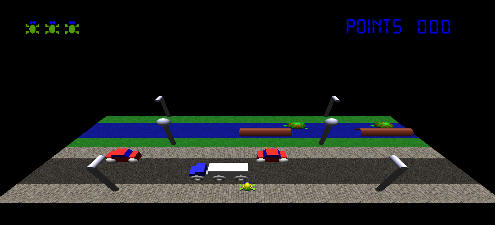
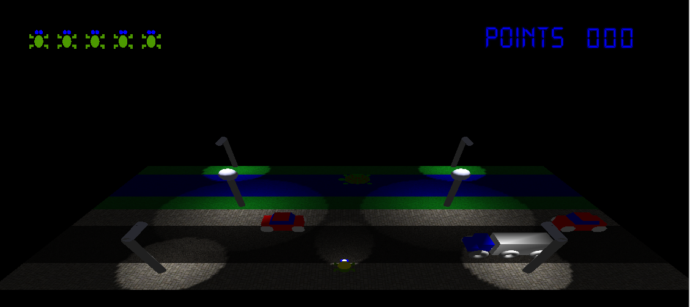
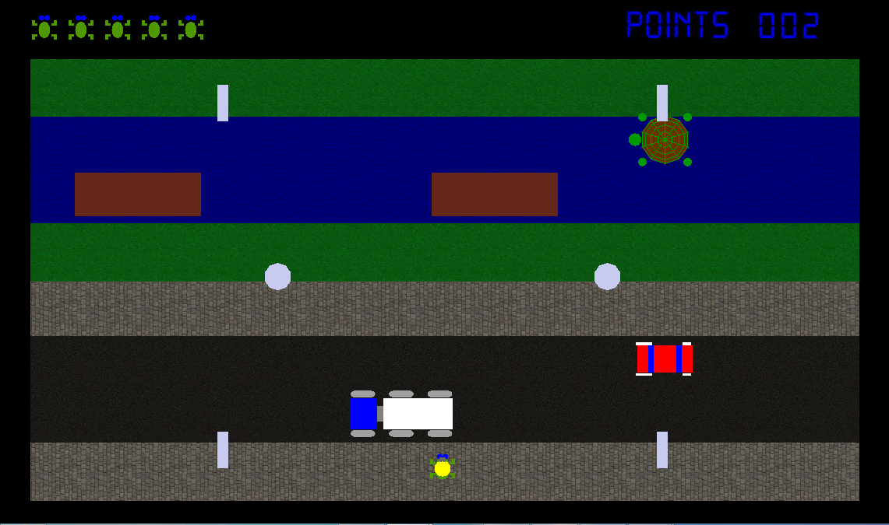
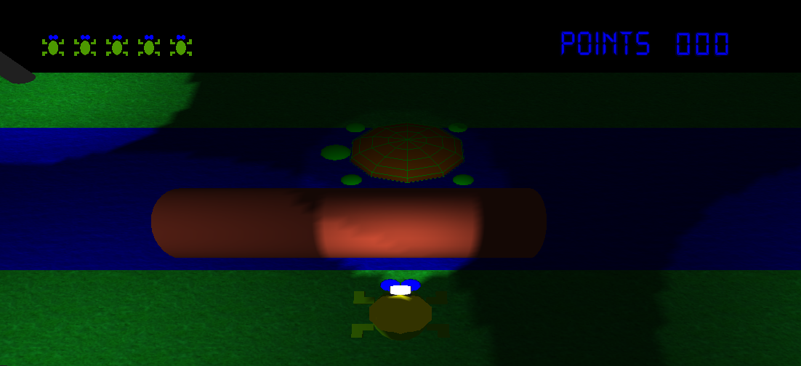

# Frogger
This is an implementation of the game Frogger in C++ done in the context of a computer graphics course at [IST](http://tecnico.ulisboa.pt/en/). The game begins in the simplest of configurations no-lighting, orthogonal view and the player has zero points (displayed in the right top of the HUD) and five lives (displayed in the left top of the HUD). A point is awarded by reaching the opposite end of the board and a life is removed every time the frog touches a car or truck or falls in the river.

<h3>Commands</h3>

The commands for manipulating both the frog and the game state are:
  - The standard WASD
  - The P button for pausing
  - The buttons 1, 2 and 3 for switching between camera modes
  - The L button to toggle lighting
  
If lighting is enabled the following additional commands are available:
  - The N button to change between day and night
  - The C button to toggle the lamps' lights
  
If the frog has no remaining lives one final command is available:
  - The R button to restart
  
<h3>Game Objects</h3>

The game has four objects:
  - Trucks 
  - Cars
  - Logs
  - Turtles

If the frog touches either a truck or a car it dies immediately and goes back to the starting point. Again, the number of lives the frog has are represented by little frog figures on the left top of the screen.
If the frog climbs on top of either a log or a turtle it's carried downstream with it. 
  
<h3>Lighting Modes</h3>

As mentioned Commands section, the lighting can be enabled with the L button and if it is enabled you can toggle between day and night with the N button. Additionaly, if we are in night mode there is no ambient light and the only lights (other than the headlamp on the helmet the frog wears - which is always on in night mode) the street lamps can be turned on if with the C button.

<h3>Camera Modes</h3>

There are three camera modes:
  - Orthogonal view - A static chessboard-like view of the game with no perspective 
  - Perspective view - A static view in which the VRP [(View Reference Point)](http://en.wikipedia.org/wiki/Viewing_frustum) is above and behind the edge of the game
  - Mobile view - A dynamic view that is always behind the frog - essentially following it 
  
You can switch between the orthogonal, perspective and mobile views by pressing, respectively, the 1, 2 and 3 buttons.

